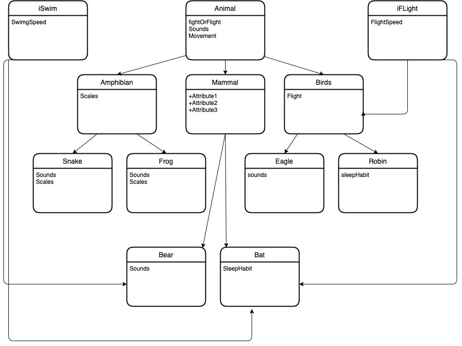
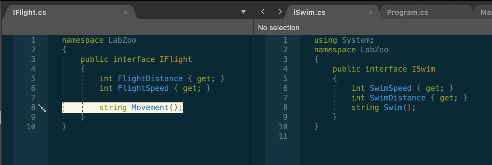

# LabSixZoo

1. an interface to me is a class that can add its properties and methods throughout the other classes in a program.
2. Interfaces
    - ISwim
        - this interface gives two properties and a method to and animal in any class that can swim regardless if it is a mammal , amphibian, or a bird.
    - IFlight
        - This interface gives two properties and a method to any animal that can fly.

